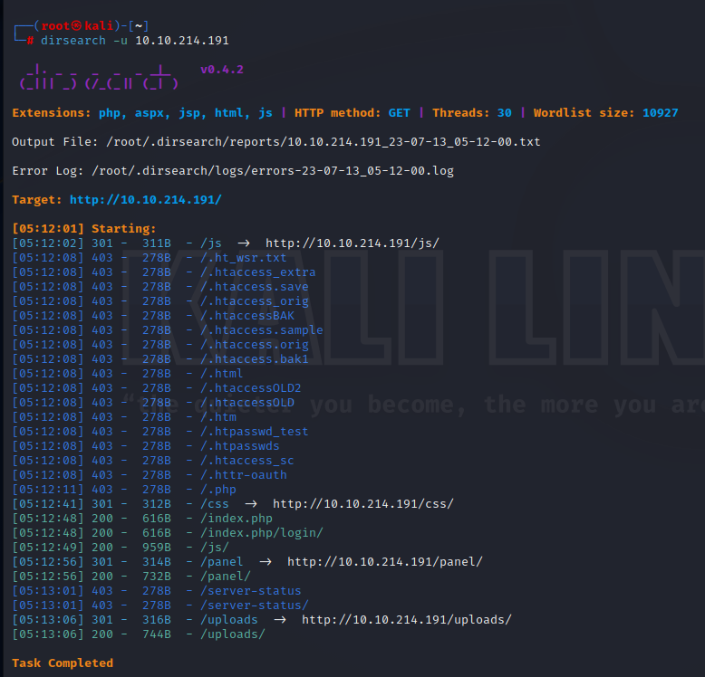
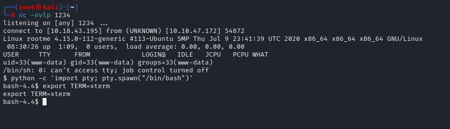

<h1>RootMe</h1>

Today we'll be looking at the RootMe machine on tryhackme.

You can find the machine [here](https://tryhackme.com/room/rrootme).

Let's start off by scanning the machine with nmap.
```
┌──(root㉿kali)-[~]
└─# nmap -sS -A -p- 10.10.47.172
Starting Nmap 7.94 ( https://nmap.org ) at 2023-07-13 07:40 UTC
Nmap scan report for ip-10-10-47-172.ec2.internal (10.10.47.172)
Host is up (0.069s latency).
Not shown: 65533 closed tcp ports (reset)
PORT   STATE SERVICE VERSION
22/tcp open  ssh     OpenSSH 7.6p1 Ubuntu 4ubuntu0.3 (Ubuntu Linux; protocol 2.0)
| ssh-hostkey:
|   2048 4a:b9:16:08:84:c2:54:48:ba:5c:fd:3f:22:5f:22:14 (RSA)
|   256 a9:a6:86:e8:ec:96:c3:f0:03:cd:16:d5:49:73:d0:82 (ECDSA)
|_  256 22:f6:b5:a6:54:d9:78:7c:26:03:5a:95:f3:f9:df:cd (ED25519)
80/tcp open  http    Apache httpd 2.4.29 ((Ubuntu))
|_http-title: HackIT - Home
|_http-server-header: Apache/2.4.29 (Ubuntu)
| http-cookie-flags:
|   /:
|     PHPSESSID:
|_      httponly flag not set
No exact OS matches for host (If you know what OS is running on it, see https://nmap.org/submit/ ).
TCP/IP fingerprint:
OS:SCAN(V=7.94%E=4%D=7/13%OT=22%CT=1%CU=33545%PV=Y%DS=2%DC=T%G=Y%TM=64AFAAA
OS:A%P=x86_64-pc-linux-gnu)SEQ(SP=104%GCD=1%ISR=10A%TI=Z%CI=Z%II=I%TS=A)SEQ
OS:(SP=104%GCD=2%ISR=10A%TI=Z%CI=Z%II=I%TS=A)OPS(O1=M509ST11NW6%O2=M509ST11
OS:NW6%O3=M509NNT11NW6%O4=M509ST11NW6%O5=M509ST11NW6%O6=M509ST11)WIN(W1=F4B
OS:3%W2=F4B3%W3=F4B3%W4=F4B3%W5=F4B3%W6=F4B3)ECN(R=Y%DF=Y%T=40%W=F507%O=M50
OS:9NNSNW6%CC=Y%Q=)T1(R=Y%DF=Y%T=40%S=O%A=S+%F=AS%RD=0%Q=)T2(R=N)T3(R=N)T4(
OS:R=Y%DF=Y%T=40%W=0%S=A%A=Z%F=R%O=%RD=0%Q=)T5(R=Y%DF=Y%T=40%W=0%S=Z%A=S+%F
OS:=AR%O=%RD=0%Q=)T6(R=Y%DF=Y%T=40%W=0%S=A%A=Z%F=R%O=%RD=0%Q=)T7(R=Y%DF=Y%T
OS:=40%W=0%S=Z%A=S+%F=AR%O=%RD=0%Q=)U1(R=Y%DF=N%T=40%IPL=164%UN=0%RIPL=G%RI
OS:D=G%RIPCK=G%RUCK=G%RUD=G)IE(R=Y%DFI=N%T=40%CD=S)

Network Distance: 2 hops
Service Info: OS: Linux; CPE: cpe:/o:linux:linux_kernel

TRACEROUTE (using port 143/tcp)
HOP RTT      ADDRESS
1   68.26 ms ip-10-18-0-1.ec2.internal (10.18.0.1)
2   68.52 ms ip-10-10-47-172.ec2.internal (10.10.47.172)

OS and Service detection performed. Please report any incorrect results at https://nmap.org/submit/ .
Nmap done: 1 IP address (1 host up) scanned in 87.05 seconds
```
We can see it's running apache and ssh.


Let's use dirsearch to discover directories on the machine.

```dirsearch -u 10.10.47.172```



We have found two interesting directories: **panel** and **uploads**.

Let's check those out.

We can see in the panel directory that we can upload files.

Let's try to uplaod a php reverse shell.

We can see that php files are not permitted.


I then tried changin the extension to **phtml** and it worked!


You can read this [checklist](https://steflan-security.com/file-upload-restriction-bypass-cheat-sheet/) about bypassing file upload.

Now, set up a netcat listner and execute the shell from the uploads folder.

We got a shell!

You can use the following commands to open a more stable shell.

```python -c 'import pty; pty.spawn("/bin/bash")'```

```export TERM=xterm```



Let's find the user flag.

```find / -type f -iname user.txt 2>/dev/null```


Now, let's esculate to root and find the root flag.

I'll use linpeas for local enumeration.

In the SUID section, we found /usr/bin/python.

Which means it will be run as root.


Let's search for python on [gtfobins](https://gtfobins.github.io/).


We are root!


