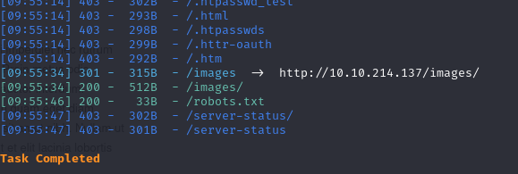
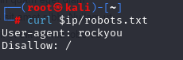
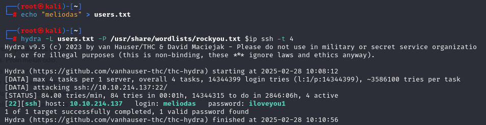
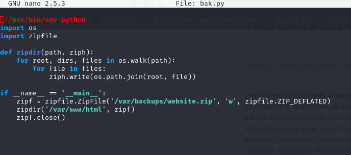
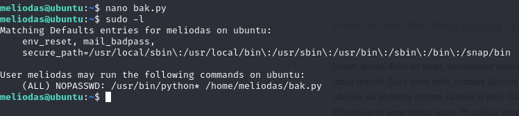
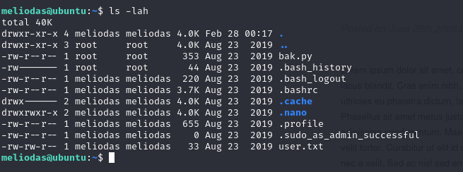
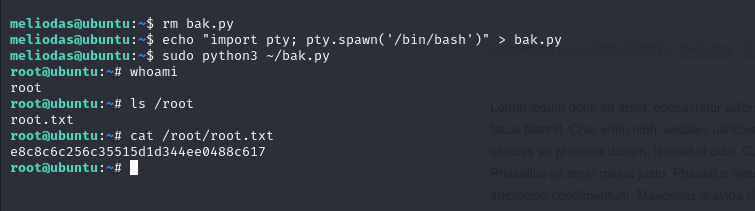

# Library
In this writeup, I will be solving the library CTF challenge on tryhackme.com
You can find it [https://tryhackme.com/room/bsidesgtlibrary]here.

First I'll scan the machine with nmap.
```
┌──(root㉿kali)-[~]
└─# export ip=10.10.214.137
                                                                                                                    
┌──(root㉿kali)-[~]
└─# nmap -A $ip                                                               
Starting Nmap 7.94SVN ( https://nmap.org ) at 2025-02-28 09:52 EET
Nmap scan report for 10.10.214.137
Host is up (0.069s latency).
Not shown: 998 closed tcp ports (reset)
PORT   STATE SERVICE VERSION
22/tcp open  ssh     OpenSSH 7.2p2 Ubuntu 4ubuntu2.8 (Ubuntu Linux; protocol 2.0)
| ssh-hostkey: 
|   2048 c4:2f:c3:47:67:06:32:04:ef:92:91:8e:05:87:d5:dc (RSA)
|   256 68:92:13:ec:94:79:dc:bb:77:02:da:99:bf:b6:9d:b0 (ECDSA)
|_  256 43:e8:24:fc:d8:b8:d3:aa:c2:48:08:97:51:dc:5b:7d (ED25519)
80/tcp open  http    Apache httpd 2.4.18 ((Ubuntu))
| http-robots.txt: 1 disallowed entry 
|_/
|_http-title: Welcome to  Blog - Library Machine
|_http-server-header: Apache/2.4.18 (Ubuntu)
No exact OS matches for host (If you know what OS is running on it, see https://nmap.org/submit/ ).
TCP/IP fingerprint:
OS:SCAN(V=7.94SVN%E=4%D=2/28%OT=22%CT=1%CU=30499%PV=Y%DS=2%DC=T%G=Y%TM=67C1
OS:6B3E%P=x86_64-pc-linux-gnu)SEQ(SP=105%GCD=1%ISR=10C%TI=Z%CI=I%II=I%TS=8)
OS:OPS(O1=M508ST11NW6%O2=M508ST11NW6%O3=M508NNT11NW6%O4=M508ST11NW6%O5=M508
OS:ST11NW6%O6=M508ST11)WIN(W1=68DF%W2=68DF%W3=68DF%W4=68DF%W5=68DF%W6=68DF)
OS:ECN(R=Y%DF=Y%T=40%W=6903%O=M508NNSNW6%CC=Y%Q=)T1(R=Y%DF=Y%T=40%S=O%A=S+%
OS:F=AS%RD=0%Q=)T2(R=N)T3(R=N)T4(R=Y%DF=Y%T=40%W=0%S=A%A=Z%F=R%O=%RD=0%Q=)T
OS:5(R=Y%DF=Y%T=40%W=0%S=Z%A=S+%F=AR%O=%RD=0%Q=)T6(R=Y%DF=Y%T=40%W=0%S=A%A=
OS:Z%F=R%O=%RD=0%Q=)T7(R=Y%DF=Y%T=40%W=0%S=Z%A=S+%F=AR%O=%RD=0%Q=)U1(R=Y%DF
OS:=N%T=40%IPL=164%UN=0%RIPL=G%RID=G%RIPCK=G%RUCK=G%RUD=G)IE(R=Y%DFI=N%T=40
OS:%CD=S)

Network Distance: 2 hops
Service Info: OS: Linux; CPE: cpe:/o:linux:linux_kernel

TRACEROUTE (using port 993/tcp)
HOP RTT      ADDRESS
1   69.96 ms 10.8.0.1
2   70.81 ms 10.10.214.137

OS and Service detection performed. Please report any incorrect results at https://nmap.org/submit/ .
Nmap done: 1 IP address (1 host up) scanned in 22.26 seconds
```

We can see that the machine is running ```http``` and ```ssh```.
I visited the http page and found a username ```meliodas```.

I then ran ```dirsearch -u http://$ip/``` to view enumerate for directories and files.



I opened robots.txt and found this:



This looks like a hint to bruteforce the ssh login with rockyou.txt.

So I used this ```hydra``` to brute force it.
And I got the password!


I then logged in and found the user flag and a python script ```bak.py```
Seems like it's creating a backup of the ```/var/www/html/``` directory.



I then found out that I can run it as root with no password.



Viewing the file permissions, I cannot modify it.


But since the file is in my home directory, I can remove and create my own ```bak.py``` script that spawns a root shell.

```
Note: For a user to delete a file, they need write (w) and execute (x) permissions on the directory that contains the file, not necessarily on the file itself.
```
That worked, and I got the root flag.



I hope this writeup was clear.
Thank You!
